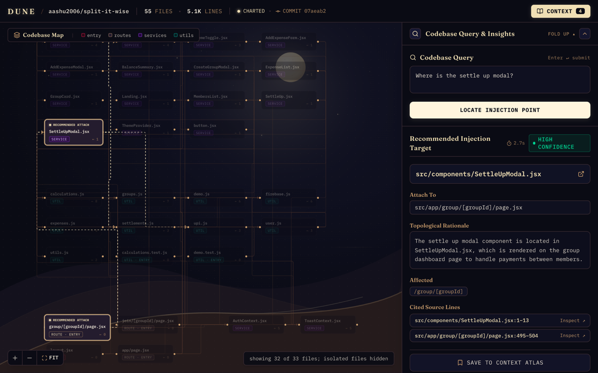
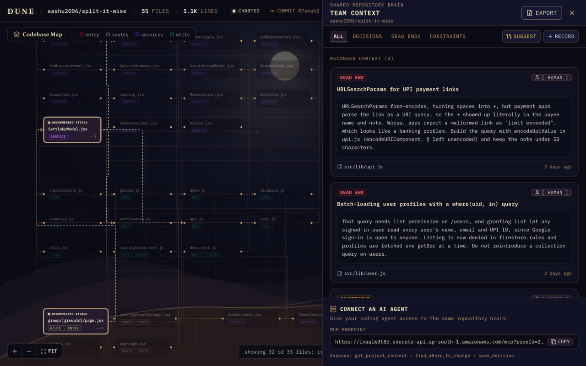

# Dune

Dune answers one question about a codebase: where does this change belong. It also stores what
the team learns about the repo, so the next person and the next AI agent start from that instead
of guessing.

Built by CloudSmiths for First Commit (WeMakeDevs x AWS), September 2026. Ship It track.

**Live: https://main.ds3vblvj49p71.amplifyapp.com**

Click "Load sample codebase" to open a pre-indexed repo. It takes about a second. Or paste any
public GitHub repo and watch it index.





## What it does

1. **Index a repo.** Paste a GitHub URL. Dune downloads the code, parses it with tree-sitter,
   builds the import graph, then chunks and embeds every file. Progress is live while it runs.
2. **Map the architecture.** Every source file is a node, every import an edge. Routes, entry
   points, services and models are marked. Click a node to read the file.
3. **Ask where a change belongs.** You get one file, the place to attach the change, the reason,
   the routes affected, the tests to update, and cited line ranges you can open and check.
4. **Keep the team's context.** Decisions, dead ends and constraints are saved once and shared.
   Every later answer is written with them in the prompt, so a rejected approach is not proposed
   again.
5. **Draft context from git.** Dune reads the diff since the indexed commit and drafts items to
   save. A person edits and approves them. Nothing is stored without that.
6. **Export it.** One button gives the whole record as markdown, ready to paste into any agent.
7. **Serve agents over MCP.** The same three things an agent needs: read the context, ask where
   to change, save a decision. Anything an agent writes is labelled as agent-written.

## How good the answers are

**29 of 30.** Ten questions with known answers, run three times, across two repos: a Next.js app
and an Express API. The expected file for each question was chosen by reading the code, before
running anything. A confident wrong answer counts as a failure. One of the ten has no answer in
the repo at all, and passes only if Dune says it does not know.

A separate set of six questions on a Python repo scored 5 of 6.

The script is in the repo: `npm run eval`, source in [`scripts/eval.ts`](scripts/eval.ts). It
prints every run, not the best one. Median answer time is 1.4 seconds.

## Architecture

All of it is serverless and scales to zero. Region is ap-south-1.

| Part | Service | What it does |
| --- | --- | --- |
| API | API Gateway (HTTP API) + `ApiFn` Lambda | Every endpoint. Retrieval and answers. |
| Indexing | `IndexFn` Lambda | One job per invocation: download, parse, chunk, embed, store. |
| MCP | `McpFn` Lambda | The MCP server, on the same API. |
| Data | DynamoDB, one table | Graph, chunks, vectors, jobs, team context. |
| Snapshots | S3 | The repo copy the file viewer reads. |
| Web app | Amplify Hosting | React and Vite, built from `main`. |
| Infra | AWS SAM | One template, one deploy command. |

Two things are worth calling out.

**Embeddings run inside the Lambda.** The model (all-MiniLM-L6-v2) is bundled into the function,
so indexing needs no model access and makes no external call. Generation uses Google Gemini
through a provider interface; Groq works too, and Bedrock is written against the same interface.

**Answers are checked, not trusted.** Every file path the model returns must exist in the index
or it is dropped. Line ranges are clamped to the real file. The model can lower its confidence
but never raise it.

## Connect an agent (MCP)

```
https://ivaqlw3t8d.execute-api.ap-south-1.amazonaws.com/mcp?repoId=255711d1
```

Streamable HTTP, no auth. `repoId` picks the repo. The context panel in the web app shows the URL
for the repo you have open.

```bash
claude mcp add --transport http dune "https://ivaqlw3t8d.execute-api.ap-south-1.amazonaws.com/mcp?repoId=255711d1"
```

Tools: `get_project_context`, `find_where_to_change`, `save_decision`.

## Run it locally

Needs Node 24, the AWS SAM CLI, and AWS credentials for ap-south-1.

```bash
npm install
cp .env.example .env            # GEMINI_API_KEY. GROQ_API_KEY and GITHUB_TOKEN are optional
npm run deploy                  # builds and deploys the stack

# Index a repo from your machine, with the pipeline IndexFn runs
REPO_BUCKET=<RepoBucketName output> npm run index -- https://github.com/owner/repo

# The web app against the deployed API
cp packages/web/.env.example packages/web/.env.local   # set VITE_API_URL
npm run dev -w @dune/web
```

`npm run eval` runs the evaluation. `npm run typecheck` checks every package.

## What is deliberately not built

- **No auth.** One shared team per link. Anyone with the URL reads and writes the same context.
- **One repo at a time.** No cross-repo search.
- **Three languages.** TypeScript, JavaScript and Python, including TSX, JSX, Flask and FastAPI.
  Nothing else is parsed.
- **Snapshots expire after 7 days.** The map and answers keep working. The file viewer stops
  until the repo is indexed again.

## More

The five specs in [`docs/`](docs/) cover the product, backend, frontend, API contract and infra.
The API contract is [`docs/03-API.md`](docs/03-API.md) and it wins over the other docs.

[`packages/indexer/src/embedders/titan.ts`](packages/indexer/src/embedders/titan.ts) is the
Bedrock embedder. It is unused and kept on purpose, as the alternative provider behind the same
interface, because our Bedrock access never arrived.
